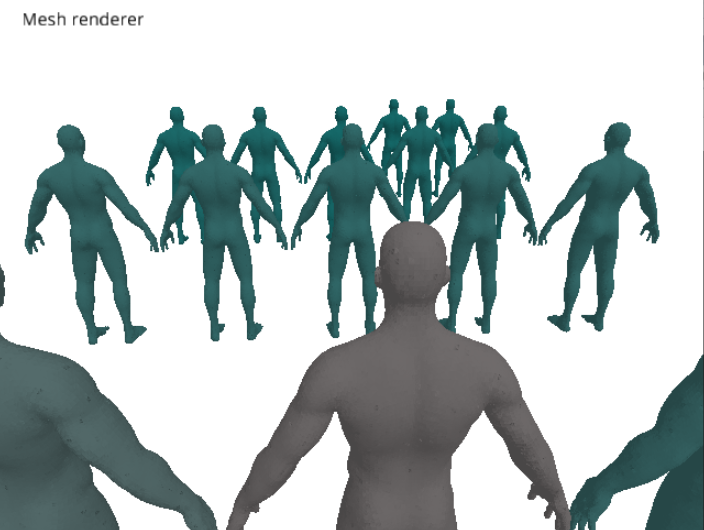

#  Occlusion Culling

Simple Occlusion Culling implementaion using OpenGL 

* This is one of the educational projects of the FRR course (Fast Realistic Rendering) in the Masters of Computer Graphics in UPC
* Practical application for Occlusion Queries
 

